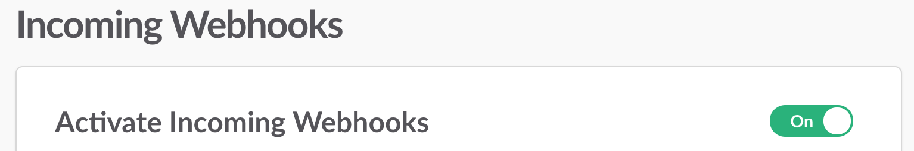

Create the Slack App for Your Team
----------------------------------

Before deploying the app on a server, you will need to create it for your Slack
team at https://api.slack.com/apps .

You will need to enable ``Incoming Webhooks``, located at `Features > Incoming Webhooks`...

...and set a ``Redirect URL``, located at `Features > OAuth & Permissions` that points to:

   *https://jackalope.mydomain.org/install*

With those two steps complete you will be able to copy the following values for
use with the deployed application environment:

* Basic Information/App Credentials/``Client ID``
* Basic Information/App Credentials/``Client Secret``

* Manage Distribution/Share Your App with Your Team/``Shareable URL``

.. note:: You will need to set these into environment variables details in the
   deployment documentation. See :ref:`environment-variables`.
