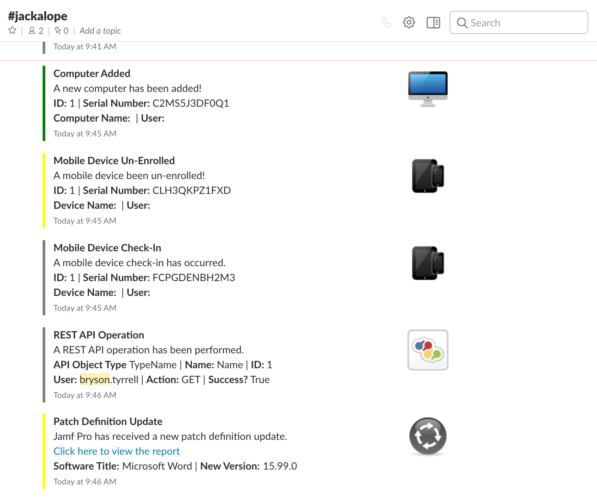

.. Jackalope documentation master file, created by
   sphinx-quickstart on Mon May 22 10:49:01 2017.
   You can adapt this file completely to your liking, but it should at least
   contain the root `toctree` directive.

Jackalope: a slacky Jamf Pro notification plugin
================================================

Welcome to Jackalope's documentation (still a work-in-progress)!

.. toctree::
   :caption: Getting Started

   getting_started/create_slack_app
   getting_started/deployment

.. toctree::
   :caption: Backend

   backend/routes
   backend/notifications
   backend/exceptions
